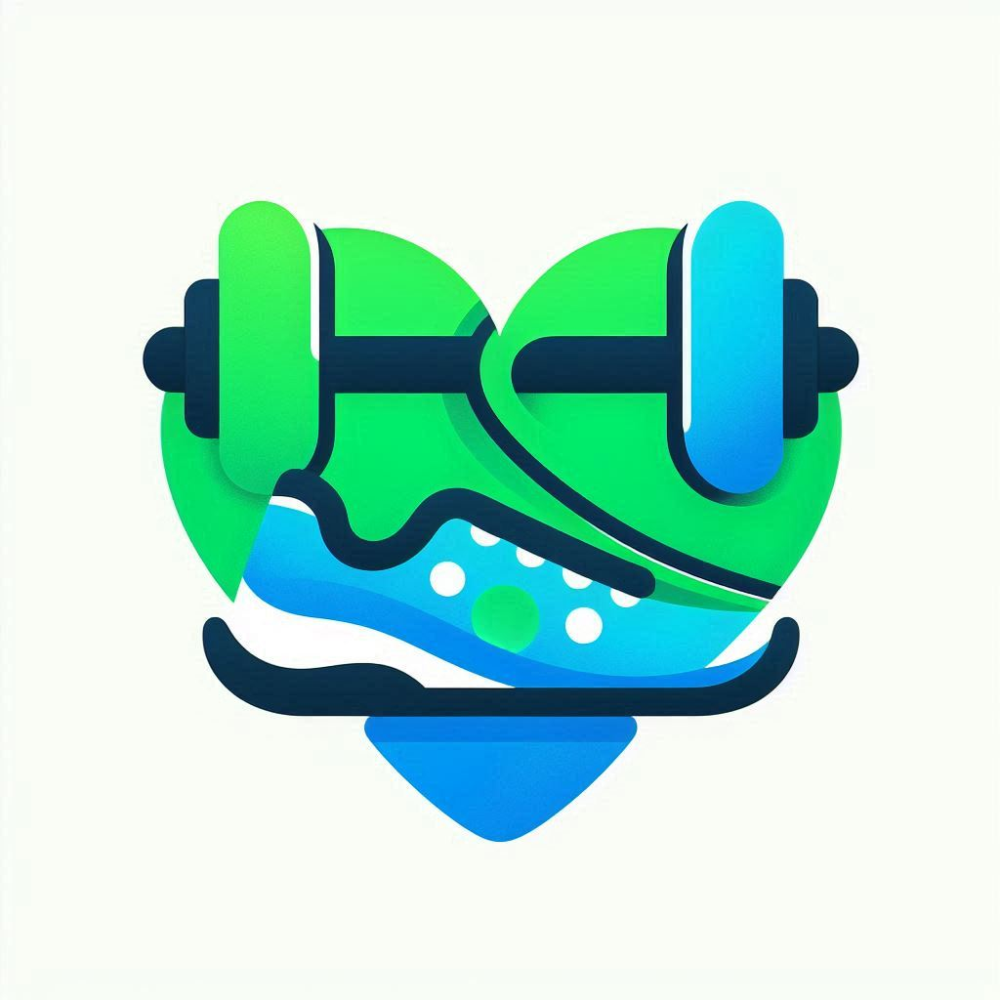

# 

## Willkommen zur Fitness-App-Organisation!

Diese Organisation widmet sich der Entwicklung einer Fitness-App, die Benutzer dazu motiviert, einen gesunden Lebensstil zu pflegen. Unsere App bietet eine Vielzahl von Funktionen, um Fitnessziele zu erreichen, eine gesunde Ernährung zu fördern und den Wettbewerb unter Freunden anzuregen.

### Features

1. **Startseite**  
   Auf der Startseite finden Nutzer eine Übersicht ihrer täglichen Fitness- und Ernährungsstatistiken. Sie können auch schnelle Zugriffe auf Rezepte, Übungen und den Freundes-Leaderboard finden.

2. **Nutri-Tracker mit Rezepten**  
   Unser Nutri-Tracker hilft den Nutzern, ihre tägliche Ernährung zu überwachen. Es werden nicht nur Kalorien gezählt, sondern auch Nährstoffe verfolgt. Außerdem bietet der Tracker eine Rezeptdatenbank mit gesunden Rezepten, die Nutzer nachkochen können.

3. **Leaderboard mit Freunden**  
   Nutzer können ihre Freunde zur App einladen und sich gegenseitig herausfordern. Das Leaderboard zeigt, wer die meisten Punkte durch gesunde Ernährung und erfolgreich absolvierte Workouts gesammelt hat.

4. **Übungen**  
   Die App enthält eine Vielzahl an Übungen, die individuell angepasst und nach Muskelgruppen oder Trainingsziel ausgewählt werden können. Benutzer können ihre eigenen Workouts planen oder vorgeschlagene Workouts basierend auf ihren Fitnesszielen ausprobieren.
